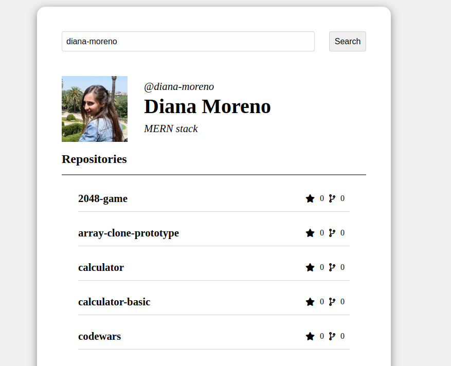
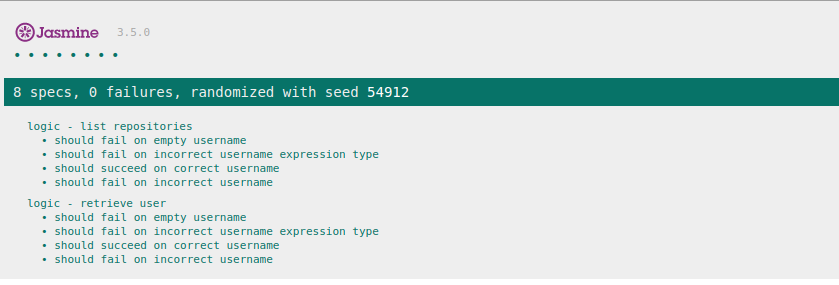

## Github repositories



## Introduction

This project brings information about Github repositories.
There is a searcher where you can introduce a Github username and it returns a repositories list with access links, besides, some public data like the avatar, name or username is shown.

Your can run the deployed project here: https://diana-moreno.github.io/github-repositories

## Technical Description

- This project has been developed with Javascript Vanilla, CSS-SASS, and following BEM rules.
- Jasmine for testing.
- Git and github.
- For the API calls, AJAX has been utilized.
- API consumed: [Github API](https://developer.github.com/v3/)

You can find more information about this API's features in:

https://developer.github.com/v3/search/#search-users

https://developer.github.com/v3/users/

## Usage

**Prerequisites:**

- Install Node.js if you haven't yet (https://nodejs.org/es/). Npm is needed but is included installing Node.js.

**Next steps:**

- Clone or download the repository in your computer.

```bash
git clone https://github.com/diana-moreno/github-repositories.git`
```
- Install the dependencies in your own repository from the main folder.

```bash
npm install
```

**Running:**

- Run de project
```bash
npm start
```

Open the project trought the links are provided by the server.

```
   │   Serving!                                        │
   │                                                   │
   │   - Local:            http://localhost:5000       │
   │   - On Your Network:  *********************   │
   │                                                   │
   │   Copied local address to clipboard!              │
```

## Instructions for testing

Open the file 'SpecRunner.html' in your browser.

## Test

The logic has been tested with Jasmine.

